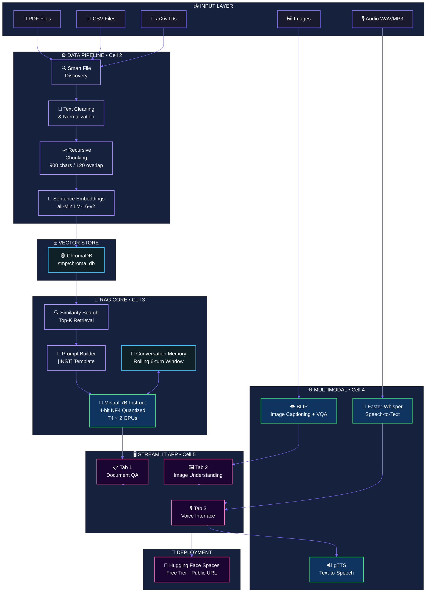
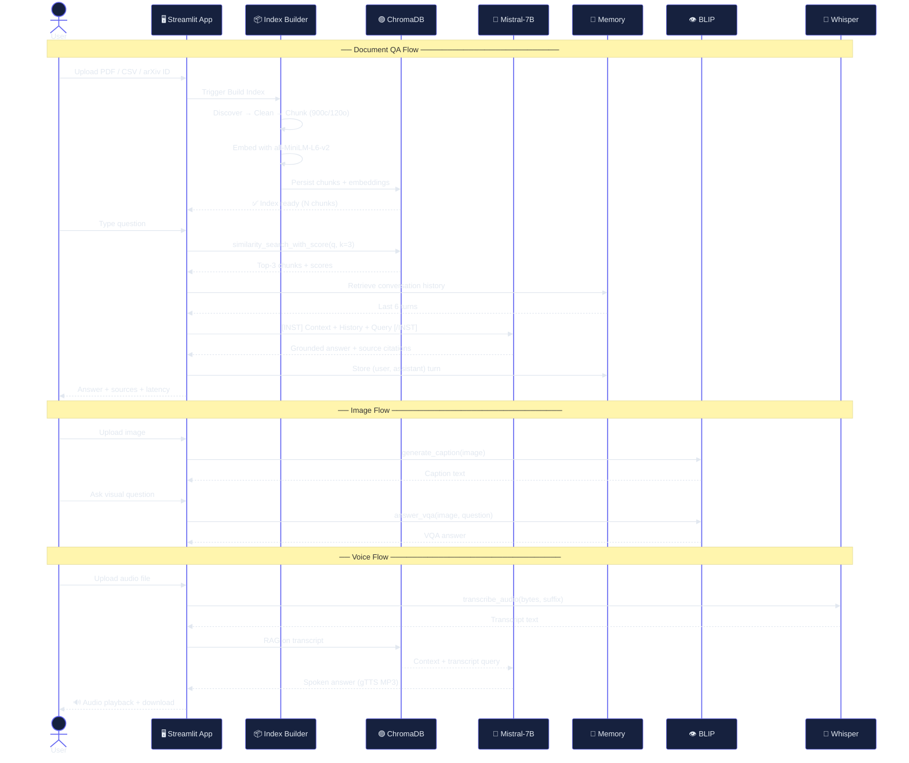

<div align="center">

<!-- ANIMATED HEADER BANNER -->


<!-- ANIMATED TYPING BADGE -->
<a href="#">
  
</a>

<br/>

<!-- STATUS BADGES -->
<p>
  
  
  
  
  
  
</p>

<!-- LIVE DEMO BUTTON -->
<br/>
<a href="https://huggingface.co/spaces">
  
</a>
&nbsp;&nbsp;
<a href="#">
  
</a>

</div>

---

<!-- WHAT IS THIS -->
<div align="center">
<h2>✦ What Is This? ✦</h2>
</div>

> **A portfolio-grade AI assistant that reads your documents, sees your images, and hears your voice — all powered by open-source models, zero cost.**
>
> Built from a messy 119-cell notebook → refactored into **5 clean, production-ready Kaggle cells** + a Streamlit app deployed on Hugging Face Spaces.

---

<!-- ARCHITECTURE DIAGRAM — ANIMATED ASCII / MERMAID -->
<div align="center">
<h2>🏗️ System Architecture</h2>
</div>



---

<!-- PIPELINE PHASES -->
<div align="center">
<h2>🔄 The 5-Cell Pipeline</h2>
<p><em>From raw 119-cell chaos → 5 clean, GPU-optimized Kaggle cells</em></p>
</div>

<table>
<tr>
<td width="60" align="center"><b>Cell</b></td>
<td width="200"><b>Name</b></td>
<td><b>What It Does</b></td>
<td width="180"><b>Key Decisions</b></td>
</tr>

<tr>
<td align="center">

```
  1
```

</td>
<td>

**⚙️ Environment Setup**

</td>
<td>
Installs all dependencies without breaking Kaggle's pre-installed packages. No <code>--upgrade</code> flag, no torch reinstall. Ends with full version + GPU verification printout.
</td>
<td>
<code>faster-whisper</code> replaces <code>openai-whisper</code> (Python 3.12 compat). <code>bitsandbytes==0.42.0</code> + <code>triton==2.3.0</code> for CUDA support.
</td>
</tr>

<tr>
<td align="center">

```
  2
```

</td>
<td>

**📥 Data Ingestion & Indexing**

</td>
<td>
Smart file discovery scans <code>/kaggle/input</code> recursively for PDFs and CSVs. Falls back to arXiv automatically if nothing is found. Cleans, chunks, embeds, and persists to ChromaDB. Produces 3 analysis plots.
</td>
<td>
<code>CHROMA_DIR = /tmp/chroma_db</code> (Kaggle working dir is read-only). Normalized metadata schema across all source types.
</td>
</tr>

<tr>
<td align="center">

```
  3
```

</td>
<td>

**🧠 RAG Core + Memory**

</td>
<td>
Loads Mistral-7B-Instruct (4-bit NF4) across both T4 GPUs. Builds <code>rag_answer()</code> for single-turn QA and <code>rag_answer_with_memory()</code> for multi-turn. Runs wildlife + generic demo questions. Produces latency plot.
</td>
<td>
<code>device_map="auto"</code> splits layers across 2× T4. Rolling 6-turn memory window stays within context limits.
</td>
</tr>

<tr>
<td align="center">

```
  4
```

</td>
<td>

**🌐 Multimodal (BLIP + Voice)**

</td>
<td>
BLIP-base for image captioning and visual question answering. Faster-Whisper for speech transcription. gTTS for text-to-speech synthesis. All results piped back through the RAG chain.
</td>
<td>
BLIP on GPU 0, Whisper on CPU (avoids VRAM conflict with Mistral). Audio bytes returned as in-memory buffer.
</td>
</tr>

<tr>
<td align="center">

```
  5
```

</td>
<td>

**🚀 App + Deployment**

</td>
<td>
Full Streamlit app with 3 tabs: Document QA, Image Understanding, Voice Interface. Writes <code>app.py</code>, <code>requirements.txt</code>, and HF Spaces <code>README.md</code> to <code>/kaggle/working</code>. Validates syntax before writing.
</td>
<td>
One-click deploy to Hugging Face Spaces. App code validated with <code>ast.parse()</code> before write.
</td>
</tr>
</table>

---

<!-- TECH STACK -->
<div align="center">
<h2>🧬 Tech Stack</h2>
</div>

<div align="center">

| Layer | Technology | Role |
|---|---|---|
| 🤖 **LLM** | `mistralai/Mistral-7B-Instruct-v0.2` | Core language understanding & generation |
| ⚡ **Quantization** | `bitsandbytes` NF4 4-bit | Fit 7B model on T4 x2 (16GB each) |
| 👁️ **Vision** | `Salesforce/blip-image-captioning-base` | Image captioning + Visual QA |
| 🎤 **STT** | `faster-whisper` | Speech-to-text transcription |
| 🔊 **TTS** | `gTTS` | Text-to-speech synthesis |
| 🔢 **Embeddings** | `all-MiniLM-L6-v2` | Semantic chunk embeddings |
| 🗄️ **Vector DB** | `ChromaDB` | Persistent similarity search |
| 🔗 **Orchestration** | `LangChain` | Document loaders, splitters, chains |
| 🖥️ **Frontend** | `Streamlit` | 3-tab interactive web app |
| ☁️ **Deploy** | `Hugging Face Spaces` | Free public hosting |
| 🖥️ **Training Env** | `Kaggle` T4 x2 | GPU-accelerated notebook |

</div>

---

<!-- DATA FLOW DETAILED -->
<div align="center">
<h2>🌊 Data Flow Deep Dive</h2>
</div>



---

<!-- FEATURES -->
<div align="center">
<h2>✨ Features At A Glance</h2>
</div>

<table>
<tr>
<td width="50%">

### 📄 Document Intelligence
- ✅ PDF ingestion (multi-page, cleaned)
- ✅ CSV ingestion (row-level documents)
- ✅ arXiv ingestion by paper ID
- ✅ Smart fallback: no file? → auto-arXiv
- ✅ Source citations in every answer
- ✅ Similarity scores shown per chunk

</td>
<td width="50%">

### 🧠 Conversation Memory
- ✅ Rolling 6-turn memory window
- ✅ Follow-up questions resolved correctly
- ✅ Memory injected into prompt template
- ✅ Clear chat button to reset state
- ✅ Full chat history displayed in UI

</td>
</tr>
<tr>
<td width="50%">

### 🖼️ Image Understanding
- ✅ Drag-and-drop image upload (JPG/PNG)
- ✅ BLIP automatic captioning
- ✅ Visual question answering (VQA)
- ✅ Side-by-side image + answer layout

</td>
<td width="50%">

### 🎙️ Voice Interface
- ✅ WAV / MP3 upload + playback
- ✅ Faster-Whisper transcription
- ✅ RAG on transcript (voice → answer)
- ✅ gTTS speech synthesis of answer
- ✅ Download spoken response as MP3

</td>
</tr>
</table>

---

<!-- ANALYSIS PLOTS -->
<div align="center">
<h2>📊 Analysis Plots Generated</h2>
<p><em>Every cell produces diagnostic visualizations for your portfolio</em></p>
</div>

```
Cell 2 → pipeline_analysis.png
├── Plot 1: Documents & Chunks per Source (grouped bar)
├── Plot 2: Chunk Length Distribution (histogram + mean/max lines)
└── Plot 3: Top-K Retrieval Similarity Scores (horizontal bars)

Cell 3 → rag_latency_analysis.png
├── Plot 1: Retrieval vs Generation Time per Query (stacked bars)
└── Plot 2: Mean Latency — Single-Turn vs Memory-Augmented
```

---

<!-- QUICK START -->
<div align="center">
<h2>🚀 Quick Start</h2>
</div>

### Option A — Try the Live App
Click the **🚀 Live Demo** button at the top. No setup needed.

### Option B — Run on Kaggle

```python
# 1. Open a new Kaggle notebook
# 2. Set Accelerator: GPU T4 x2 (Settings → Accelerator)
# 3. Paste and run cells in order:

Cell 1  →  Environment setup & verification
Cell 2  →  Data ingestion, cleaning, chunking, indexing
Cell 3  →  RAG core (Mistral-7B + conversation memory)
Cell 4  →  Multimodal (BLIP + Whisper + gTTS)
Cell 5  →  Streamlit app generation + deployment files
```

### Option C — Deploy to Hugging Face Spaces

```bash
# After running Cell 5, download from /kaggle/working:
app.py
requirements.txt
README.md

# Then:
# 1. Go to huggingface.co/new-space
# 2. SDK: Streamlit
# 3. Hardware: CPU Basic (free) or GPU T4 (free tier)
# 4. Upload the 3 files above
# 5. HF auto-installs and launches ✅
```

---

<!-- ERROR LOG / WHAT WE FIXED -->
<div align="center">
<h2>🔧 Battle-Tested: What We Fixed</h2>
<p><em>This notebook was debugged live — every fix is baked in</em></p>
</div>

| # | Error | Root Cause | Fix Applied |
|---|---|---|---|
| 1 | `openai-whisper` build fails | Python 3.12 incompatibility | Replaced with `faster-whisper==1.0.3` |
| 2 | `chromadb` AttributeError `np.float_` | NumPy 2.0 removed `np.float_` | Pinned `chromadb==0.4.24` |
| 3 | `accelerate` missing `clear_device_cache` | Kaggle peft needs accelerate ≥ 0.34 | Bumped to `accelerate==0.34.2` |
| 4 | `transformers` missing `EncoderDecoderCache` | Kaggle peft needs transformers ≥ 4.43 | Bumped to `transformers==4.44.2` |
| 5 | `Chroma` write error | Kaggle working dir is read-only | Set `CHROMA_DIR = /tmp/chroma_db` |
| 6 | `bitsandbytes` no CUDA support | Pre-installed bnb is CPU-only | Pinned `bitsandbytes==0.42.0` + `triton==2.3.0` |
| 7 | `bnb_4bit_double_quant` unknown kwarg | API rename in newer bnb | Renamed to `bnb_4bit_use_double_quant` |
| 8 | `langchain_community.embeddings` deprecated | HF embeddings moved to new package | Switched to `langchain-huggingface==0.0.3` |

---

<!-- PROJECT STRUCTURE -->
<div align="center">
<h2>📁 Project Structure</h2>
</div>

```
multimodal-rag-assistant/
│
├── 📓 notebook.ipynb              ← 5-cell Kaggle notebook (runnable)
│   ├── Cell 1  ⚙️  Environment
│   ├── Cell 2  📥  Data Pipeline
│   ├── Cell 3  🧠  RAG Core
│   ├── Cell 4  🌐  Multimodal
│   └── Cell 5  🚀  App Export
│
├── 🖥️  app.py                     ← Streamlit app (generated by Cell 5)
├── 📋  requirements.txt           ← Exact pinned versions (generated)
├── 📖  README.md                  ← This file
│
└── 📊  analysis/
    ├── pipeline_analysis.png      ← Cell 2 plots
    └── rag_latency_analysis.png   ← Cell 3 plots
```

---

<!-- LIMITATIONS -->
<div align="center">
<h2>⚠️ Known Limitations</h2>
</div>

- **Cold start** on HF Spaces free tier takes ~3–5 min (model loading)
- **VRAM constraint**: Mistral-7B 4-bit uses ~9GB per GPU; very long contexts may OOM
- **arXiv fallback** uses paper `2201.11095` (RAG survey) — change `ARXIV_FALLBACK_ID` constant for your domain
- **pyttsx3 removed** in final app (no audio device on server) — replaced with `gTTS` (cloud-based, returns bytes)
- **No authentication** — this is a public portfolio demo, not production

---


<div align="center">

**Built with 🔥 on Kaggle T4 x2 | Deployed free on 🤗 Hugging Face Spaces**

<sub>All models are open-source. No API keys. No paid services.</sub>

<br/>


</div>
